**完整代码收费  加qq  931708230 或者加微信  ynwwxid**

**接毕业设计和论文**

**博客地址：[https://blog.csdn.net/2303_76227485/article/details/128649854](https://blog.csdn.net/2303_76227485/article/details/128649854)**

**视频演示：[https://www.bilibili.com/video/BV14u4y1o7qx](https://www.bilibili.com/video/BV14u4y1o7qx)**

**毕业设计所有选题地址：[https://github.com/ynwynw/allProject](https://github.com/ynwynw/allProject)**

## 基于springboot+vue的宠物交易/领养系统 (源代码+数据库)

## 一、系统介绍

包括管理员、普通用户两种角色，外加游客(未登录情况)

权限  游客 < 普通用户 < 管理员

1、游客功能

查看宠物信息

2、普通用户功能

出售/领养宠物、购买/收养宠物、订单管理、地址管理

和卖家/卖家对话

个人信息修改、密码修改

3、管理员功能

用户管理、地址管理、宠物管理、订单管理

个人信息、密码修改

## 二、所用技术

后端技术栈：

-  springboot+mybatis+mysql+

前端技术栈：

- vue

## 三、环境介绍

基础环境 :IDEA/eclipse, JDK 1.8, Mysql5.7及以上,Maven

源码+数据库脚本

所有项目以及源代码本人均调试运行无问题 可支持远程调试运行

## 四、页面截图

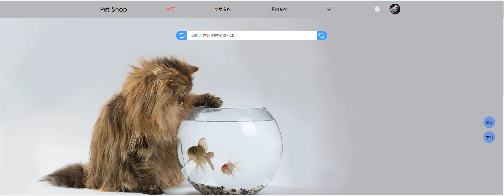

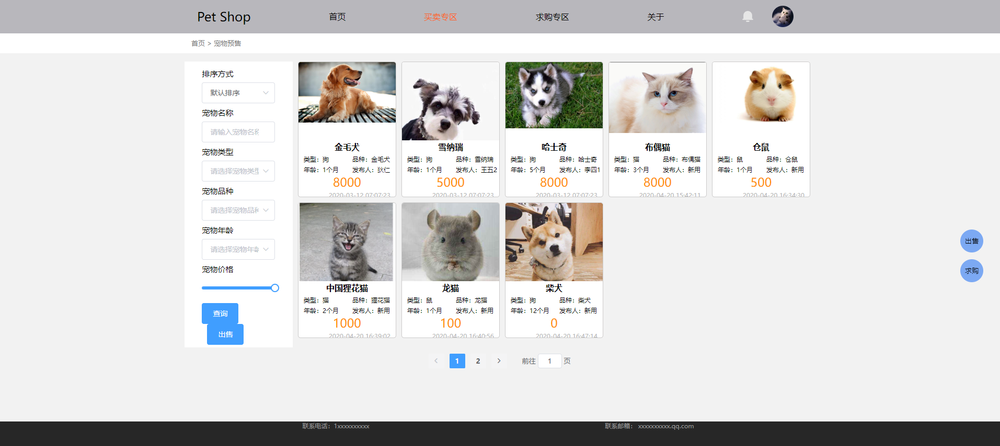

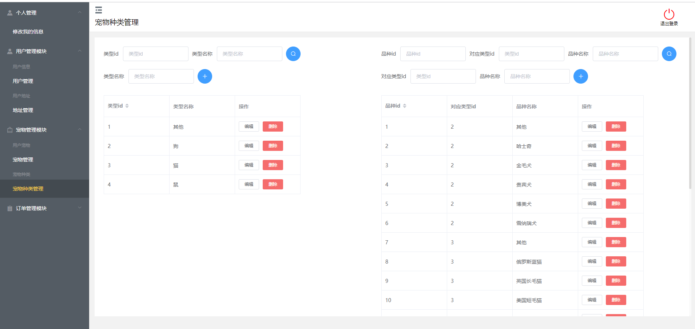

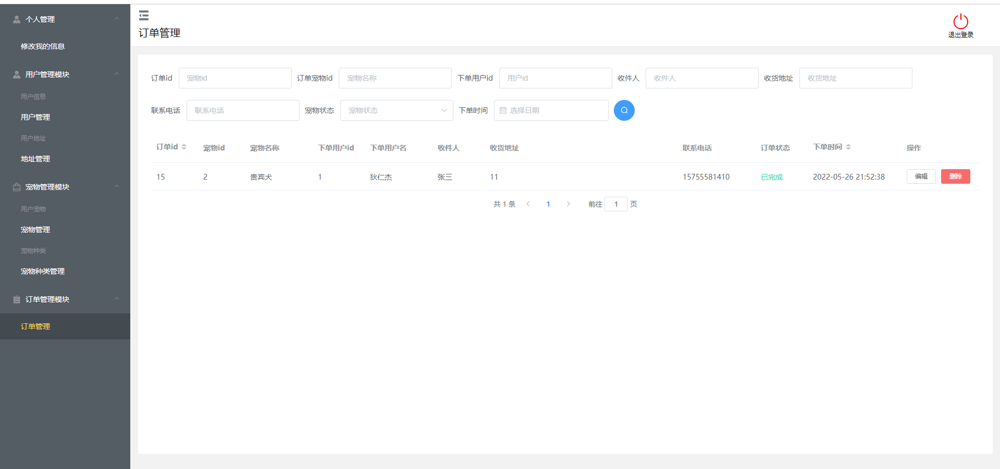

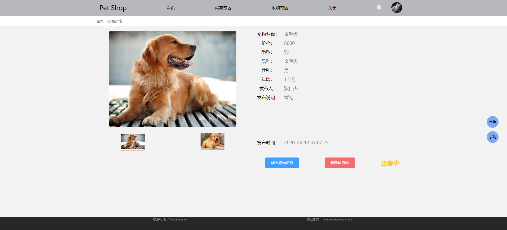

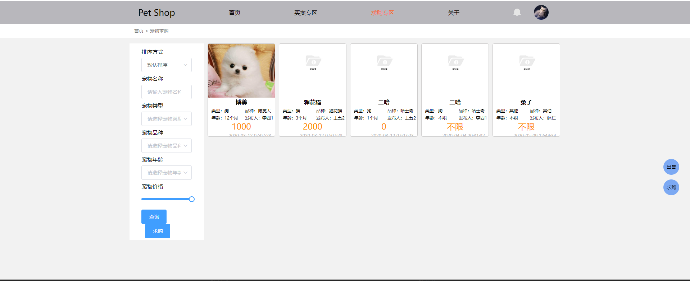

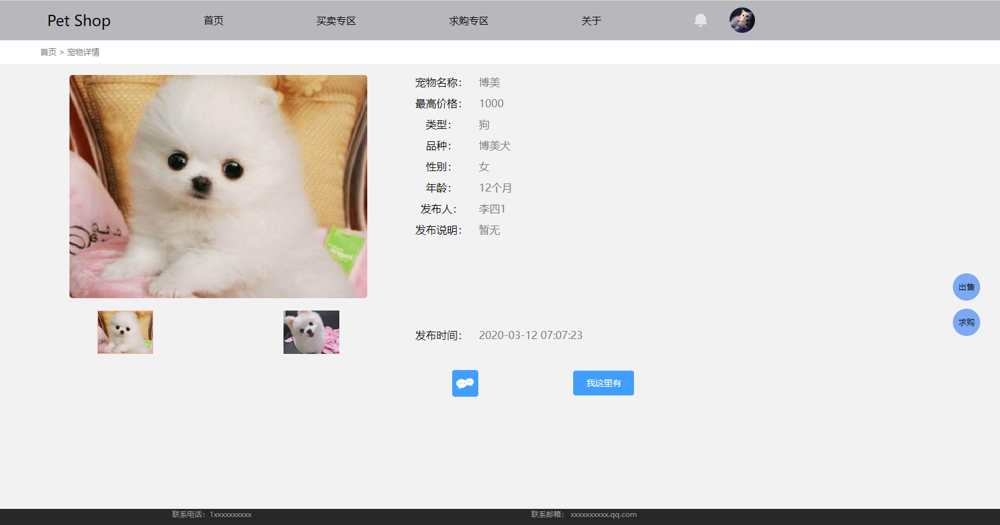

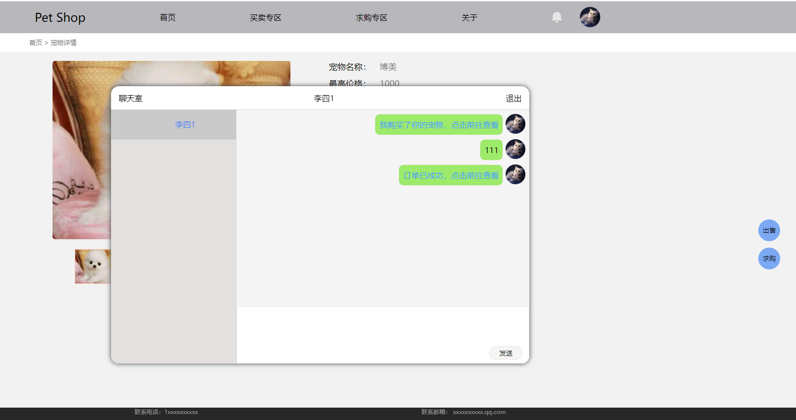

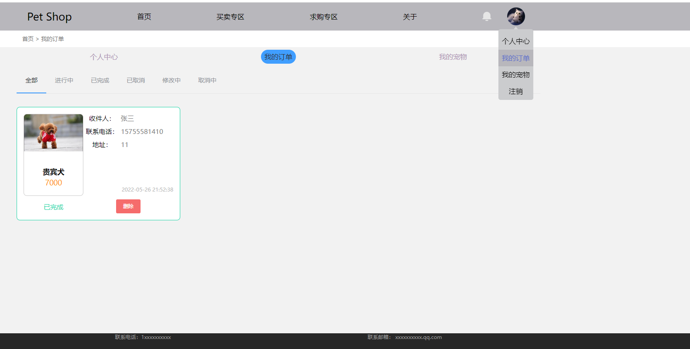

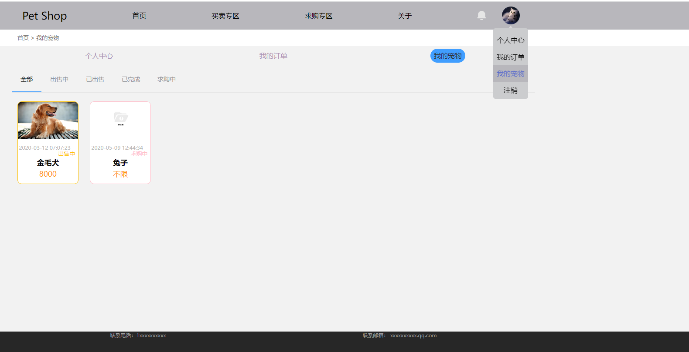

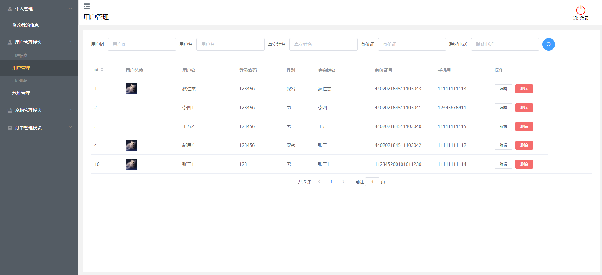

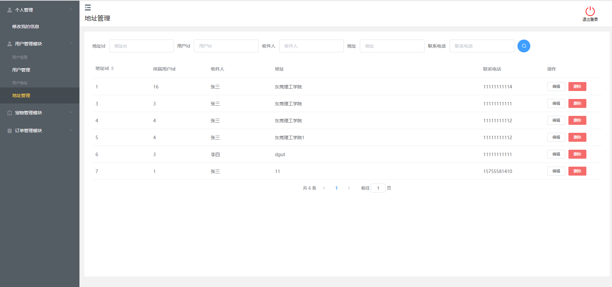

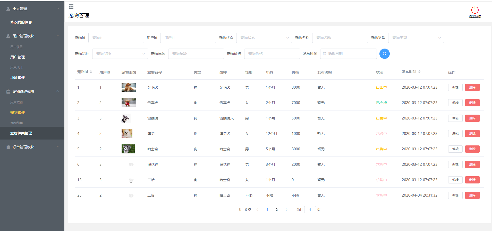

## 五、浏览地址

登录地址  http://localhost:8082/home

普通用户：用户名：李四1   密码：  123456

管理员       用户名：管理员  密码：123456

## 六、安装教程

1. 使用Navicat或者其它工具，在mysql中创建对应名称的数据库，并导入项目的sql文件；
2. 使用IDEA/Eclipse/MyEclipse导入项目，Eclipse/MyEclipse导入时，若为maven项目请选择maven;
   若为maven项目，导入成功后请执行maven clean;maven install命令，然后运行；
3. 修改application.yml 里面的数据库配置和redis配置
4. 启动项目后端项目 
5. vscode打开pettrading项目
6. 打开终端，执行npm install 依赖下载完成后执行 npm run dev或npm run serve,执行成功后会显示访问地址
7. 访问  http://localhost:8082/home

**需要完整代码可以加qq  931708230 或者加微信 ynwwxid**

##### pet-trading文件夹：后端代码

##### pettrading文件夹： 前端代码

##### pet.sql ：数据库文件

##### 
